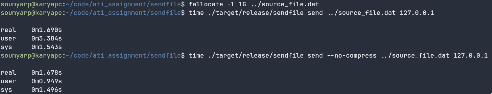
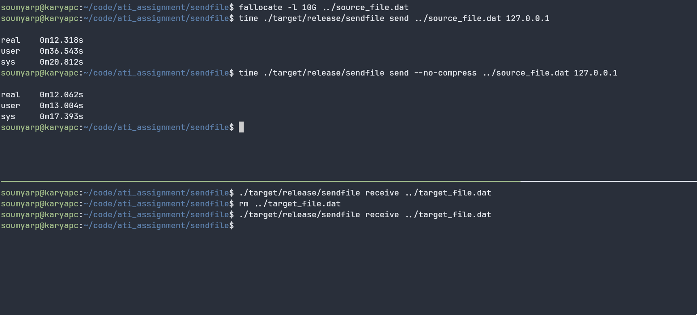

# Sendfile - TCP File Transfer Utility

A cross-platform file transfer utility capable of securely transferring files over the network using TCP.

To learn more about how it works, see [ARCHITECTURE.md](ARCHITECTURE.md).

## Features

- **Large File Support**: Transfers files up to 16 GB
- **Integrity Verification**: BLAKE3 hash for file integrity, CRC32 checksums per block
- **Error Handling**: Automatic retries with exponential backoff (5 retries per block)
- **Cross-Platform**: Written in Rust, works on Windows, macOS, and Linux
- **Bandwidth Optimization**:
  - Concurrent connections for parallel transfer
  - Gzip compression with smart probing (only compresses when beneficial)
- **Resume Support**: Verifies existing blocks on partial transfers

## Requirements

- Rust 1.75 or later

## Build

```bash
# Debug build
cargo build

# Release build (recommended for performance)
cargo build --release

# Clean build
cargo clean && cargo build --release
```

## Usage

### Receiver (Server)

Start the receiver on the destination machine:

```bash
# Receive to a directory (file will be saved with original name)
./target/release/sendfile receive /output/directory

# Receive to a specific filename
./target/release/sendfile receive /output/directory/myfile.bin

# With custom concurrency (default: auto-detected based on CPU cores, max 16)
./target/release/sendfile receive /output/directory --concurrency 8
```

### Sender (Client)

Send a file to a receiver:

```bash
./target/release/sendfile send /path/to/file 192.168.1.100

# With custom block size (default: 1MB, max: 4MB)
./target/release/sendfile send /path/to/file 192.168.1.100 --block-size 2097152

# With custom concurrency
./target/release/sendfile send /path/to/file 192.168.1.100 --concurrency 8
```

## CLI Options

### Send Command

| Option              | Description                      | Default              |
| ------------------- | -------------------------------- | -------------------- |
| `FILE`              | Path to the file to send         | Required             |
| `HOST`              | Receiver host or IP address      | Required             |
| `--block-size, -b`  | Block size in bytes              | 1048576 (1 MB)       |
| `--concurrency, -c` | Number of concurrent connections | Auto (min 8, max 16) |

### Receive Command

| Option              | Description                      | Default              |
| ------------------- | -------------------------------- | -------------------- |
| `PATH`              | Output path (directory or file)  | Required             |
| `--concurrency, -c` | Number of concurrent connections | Auto (min 8, max 16) |

## Protocol

### Ports

- **Handshake**: 7878 (sender connects to receiver)
- **Transfer**: 7879 (multiple concurrent connections)

### Message Format

Each message has headers:

```
Ver: <protocol_version>\r\n
Len: <payload_length>\r\n
\r\n
<serialized_payload>
```

## Testing

```bash
# Run all unit tests
cargo test

# Run with output
cargo test -- --nocapture

# Run specific test
cargo test test_name
```

## Performance Considerations

- **Concurrency**: Automatically scales to available CPU cores (capped at 16)
- **Block Size**: Configurable up to 4 MB for optimal throughput
- **Compression**: Smart probing determines if compression helps (only applied when size reduces)
- **Parallel Hashing**: BLAKE3 hash computed in parallel for large files

## Perfomance Metrics

Below table demonstrates the time taken to transfer a 1G file on the same system over a TCP socket.

| Metric              | Without Compression | With Compression |
| ------------------- | ------------------- | ---------------- |
| Time                | 1.678s              | 1.690s           |
| Estimated Bandwidth | 595.94 MBps         | 591.7 MBps       |



For larger files, the performance is even better, since the fixed time at the beginning of the process spent towards
file hashing takes up a smaller share of the overall send.

Below is an example with a 10G file transfer

| Metric              | Without Compression | With Compression |
| ------------------- | ------------------- | ---------------- |
| Time                | 12.062s             | 12.318s          |
| Estimated Bandwidth | 829.05 MBps         | 811.82 MBps      |



## Demo


